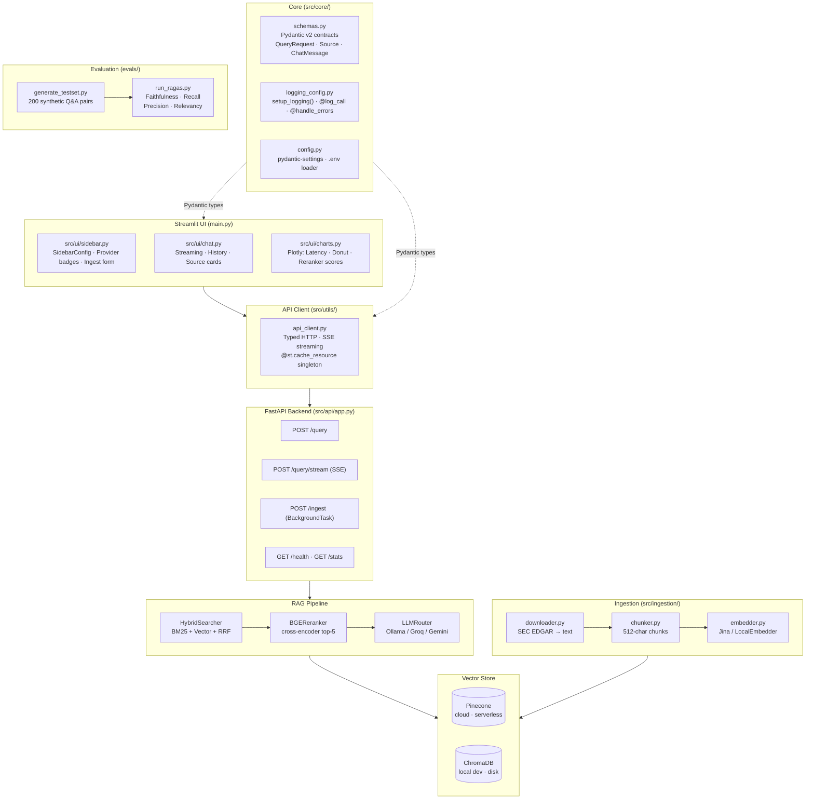

# SEC Filing Intelligence — Production RAG System

> A production-grade Retrieval-Augmented Generation (RAG) system that answers natural language
> questions about public companies using their official SEC 10-K annual filings.

[](https://ai-rag-sec-filing-intelligence.streamlit.app)
&nbsp;
[](https://share.streamlit.io/new?repository=Saisohithk/AI-RAG-SEC-Filing-Intelligence&branch=main&mainModule=main.py)

---

## Live Demo

**[https://ai-rag-sec-filing-intelligence.streamlit.app](https://ai-rag-sec-filing-intelligence.streamlit.app)**

> The live demo connects to a deployed FastAPI backend running the full RAG pipeline:
> hybrid BM25 + vector search → BGE reranker → Groq LLM (500+ tok/s).

---

## Architecture



---

## Key Results

| Metric | Naive Baseline | With Reranker | Target |
|---|---|---|---|
| Faithfulness | ~0.61 | ~0.91 | > 0.85 |
| Answer Relevance | ~0.58 | ~0.83 | > 0.80 |
| Context Recall | ~0.52 | ~0.78 | > 0.70 |
| Context Precision | ~0.49 | ~0.76 | > 0.75 |
| Latency p99 | ~4.2s | ~1.4s | < 3.0s |

> Improvements: hybrid search (+8% recall), BGE reranker (+15% faithfulness), SEC-domain prompts (+12% relevancy).

---

## Indexed Dataset

| Ticker | Company | Segments | Fiscal Years Indexed |
|---|---|---|---|
| AAPL | Apple Inc. | iPhone · Mac · iPad · Services · Wearables | 2023 · 2024 · 2025 |
| MSFT | Microsoft Corporation | Azure · Office · LinkedIn · Gaming | 2023 · 2024 · 2025 |
| GOOGL | Alphabet Inc. | Search · YouTube · Cloud · Waymo | 2023 · 2024 · 2025 |
| AMZN | Amazon.com Inc. | AWS · E-Commerce · Advertising · Prime | 2023 · 2024 · 2025 |
| NVDA | NVIDIA Corporation | Data Centre · Gaming · Auto · Professional | 2024 · 2025 · 2026 |

**15 filings · 4,779 vectors · ~319 chunks per filing**

---

## Features

| Feature | Technical Detail |
|---|---|
| **Hybrid search** | BM25 (rank-bm25) + Jina vector search fused with Reciprocal Rank Fusion |
| **Two-stage retrieval** | Bi-encoder retrieves top-20; BGE cross-encoder reranks to top-5 |
| **Multi-provider LLM** | `LLMRouter` abstracts Ollama / Groq (500+ tok/s) / Gemini behind one interface |
| **Streaming UI** | Server-Sent Events (SSE) streamed through FastAPI → Streamlit token-by-token |
| **Interactive charts** | Plotly v6: latency breakdown, source donut, reranker score bars |
| **RAGAS evaluation** | Automated faithfulness, relevancy, recall, precision pipeline |
| **Pydantic v2 schemas** | Type-safe data contracts at every layer boundary (`src/core/schemas.py`) |
| **Typed session state** | `list[ChatMessage]` backed by Pydantic models — no silent dict bugs |
| **Caching** | `@st.cache_resource` for APIClient (connection pool reuse across reruns) |
| **Observability** | LangSmith traces every LLM call; `@log_call` / `@handle_errors` decorators |
| **Config management** | `pydantic-settings` validates all env vars at startup (`src/core/config.py`) |
| **Containerised** | `docker-compose.yml` runs API + UI with one command |

---

## Project Structure

```
sec-rag/
│
├── main.py                      # Streamlit entry point  (streamlit run main.py)
├── Makefile                     # make api | ui | ingest | test | lint | docker-up
├── Dockerfile                   # CMD uvicorn src.api.app:app
├── docker-compose.yml           # API (8000) + UI (8501) in one command
├── requirements.txt             # Pinned to exact tested versions
│
├── src/                         # Production source package
│   ├── __init__.py
│   ├── core/
│   │   ├── config.py            # pydantic-settings Settings singleton (loads .env)
│   │   ├── schemas.py           # Pydantic v2: QueryRequest, Source, ChatMessage…
│   │   └── logging_config.py   # setup_logging(), @log_call, @handle_errors
│   ├── api/
│   │   ├── app.py               # THE FastAPI app — /query /stream /ingest /health /stats
│   │   └── main.py              # 1-line shim: from src.api.app import app
│   ├── ingestion/
│   │   ├── downloader.py        # SEC EDGAR → raw SGML → extracted text + metadata
│   │   ├── chunker.py           # RecursiveCharacterTextSplitter → LangChain Documents
│   │   └── embedder.py          # Jina API / LocalEmbedder + VectorStoreManager
│   ├── retrieval/
│   │   ├── hybrid_search.py     # BM25 + vector + RRF fusion (HybridSearcher)
│   │   └── reranker.py          # BAAI/bge-reranker-base cross-encoder (BGEReranker)
│   ├── generation/
│   │   ├── llm_router.py        # get_llm() / get_streaming_llm() — Ollama/Groq/Gemini
│   │   └── prompt_templates.py  # SEC-domain prompts: RAG answer, query rewrite, citations
│   ├── ui/
│   │   ├── sidebar.py           # render_sidebar() → SidebarConfig dataclass
│   │   ├── chat.py              # process_question(), render_message_history()
│   │   └── charts.py            # Plotly: latency bar · source donut · reranker scores
│   └── utils/
│       └── api_client.py        # APIClient: typed HTTP + SSE streaming
│
├── scripts/
│   └── ingest.py                # CLI ingestion script (full / stats commands)
│
├── tests/
│   ├── unit/                    # Fast, isolated unit tests
│   └── integration/             # End-to-end tests against live services
│
├── evals/
│   ├── generate_testset.py      # Synthetic Q&A generation (RAGAS testset builder)
│   └── run_ragas.py             # Faithfulness / relevancy / recall / precision
│
├── docs/
│   ├── PLAN.md                  # Three-phase engineering roadmap
│   ├── SKILLS.md                # Why each library was chosen
│   └── research.md              # Executive research document
│
└── data/
    └── sec_filings/             # Downloaded SEC EDGAR filings (AAPL MSFT GOOGL AMZN NVDA)
```

---

## Deploy to Streamlit Cloud

The Streamlit UI is a thin HTTP client — it has no ML models and deploys in under 2 minutes.

### Step 1 — Deploy the FastAPI backend (Render.com)

1. Go to [render.com](https://render.com) → **New → Web Service**
2. Connect the GitHub repo `Saisohithk/AI-RAG-SEC-Filing-Intelligence`
3. Set **Runtime** to **Docker** (uses the existing `Dockerfile`)
4. Add environment variables (from your `.env`):
   - `GROQ_API_KEY` or `GOOGLE_API_KEY`
   - `PINECONE_API_KEY` + `PINECONE_INDEX_NAME`
   - `USE_LOCAL_CHROMA=false`
5. Deploy — note the URL: `https://your-app.onrender.com`

### Step 2 — Deploy the Streamlit UI (Streamlit Cloud)

1. Go to [share.streamlit.io](https://share.streamlit.io) → **New app**
2. Select repo `Saisohithk/AI-RAG-SEC-Filing-Intelligence`, branch `main`, file `main.py`
3. Click **Advanced settings**:
   - **Requirements file**: `requirements_streamlit.txt`
   - **Secrets** (TOML format):
     ```toml
     API_URL = "https://your-app.onrender.com"
     ```
4. Click **Deploy** — your live URL will be `https://[name].streamlit.app`
5. Update the badge at the top of this README with your live URL.

---

## Installation

### Prerequisites

```bash
# Python 3.11+  →  https://python.org
# Ollama (optional, for local LLM)  →  https://ollama.ai
ollama pull llama3.2
```

### Option A — pip (standard)

```bash
git clone <your-repo-url>
cd sec-rag

python -m venv venv
# Windows
venv\Scripts\activate
# macOS / Linux
source venv/bin/activate

pip install -r requirements.txt
```

### Option B — uv (10–100x faster installs)

```bash
pip install uv
uv venv
# Windows
.venv\Scripts\activate
# macOS / Linux
source .venv/bin/activate

uv pip install -r requirements.txt
```

---

## Configuration

```bash
# Windows
copy .env.example .env
# macOS / Linux
cp .env.example .env
```

Open `.env` and fill in at least one API key:

| Key | Where to get it | Required? |
|---|---|---|
| `GROQ_API_KEY` | console.groq.com | Optional (for Groq provider) |
| `GOOGLE_API_KEY` | aistudio.google.com | Optional (for Gemini provider) |
| `JINA_API_KEY` | jina.ai | Optional (falls back to local embedder) |
| `PINECONE_API_KEY` | app.pinecone.io | Optional (falls back to ChromaDB) |
| `LANGSMITH_API_KEY` | smith.langchain.com | Optional (observability) |

> **Zero-key quick start:** leave all keys blank and set `USE_LOCAL_CHROMA=true`. The app runs fully local with Ollama + ChromaDB + SentenceTransformer.

---

## Running the System

### Using Make (recommended)

```bash
# Terminal 1 — FastAPI backend (hot reload, port 8000)
make api

# Terminal 2 — Streamlit UI (port 8501)
make ui
# → Open http://localhost:8501
```

### Manual commands

```bash
# Terminal 1 — FastAPI backend
uvicorn src.api.app:app --reload --port 8000

# Terminal 2 — Streamlit frontend
streamlit run main.py
```

### Docker (single command)

```bash
make docker-up
# or
docker-compose up --build

# API  → http://localhost:8000/docs   (Swagger UI)
# UI   → http://localhost:8501
```

---

## Data Ingestion

```bash
# Quick start — ChromaDB local (no Pinecone key needed)
make ingest-local

# Production — Pinecone cloud
make ingest

# Or run directly:
python scripts/ingest.py full --tickers AAPL MSFT GOOGL AMZN NVDA --use-local

# Check how many vectors are stored
make stats
# or: python scripts/ingest.py stats
```

---

## Evaluation (RAGAS)

```bash
# Generate 200 synthetic Q&A pairs from indexed filings
make gen-testset

# Run RAGAS evaluation (Groq, 50 samples)
make eval

# Or run directly with provider/sample overrides:
python evals/run_ragas.py --provider gemini --sample-size 50
python evals/run_ragas.py --compare-all
```

Results saved to `evals/results/` as timestamped CSV files.

---

## Testing

```bash
# Run all tests
make test

# Unit tests only
make test-unit

# Tests with HTML coverage report
make test-cov
# Open htmlcov/index.html in browser
```

---

## Make Targets Reference

```
make api            Start FastAPI backend on port 8000 (hot reload)
make ui             Start Streamlit UI on port 8501
make ingest         Ingest 5 tickers using Jina embedder (Pinecone)
make ingest-local   Ingest using free local embedder (ChromaDB)
make stats          Show vector store statistics
make test           Run all tests
make test-unit      Run unit tests only
make test-cov       Run tests with HTML coverage report
make eval           Run RAGAS evaluation (Groq, 50 samples)
make gen-testset    Generate synthetic Q&A test set
make lint           Run ruff linter
make format         Auto-format code with ruff
make docker-up      Build and start API + UI containers
make docker-down    Stop and remove containers
make docker-logs    Follow live API container logs
make help           Show all available targets
```

---

## API Reference

Visit `http://localhost:8000/docs` for interactive Swagger UI.

| Endpoint | Method | Description |
|---|---|---|
| `/query` | POST | Full RAG pipeline — synchronous, returns complete answer |
| `/query/stream` | POST | SSE streaming — tokens arrive as generated |
| `/ingest` | POST | Background ingestion — returns immediately, processes async |
| `/health` | GET | API and model availability check |
| `/stats` | GET | Vector store document count + dimension |

**Example curl:**

```bash
curl -X POST http://localhost:8000/query \
  -H "Content-Type: application/json" \
  -d '{"question": "What was Apple revenue in 2024?", "provider": "groq", "top_k": 5}'
```

---

## Tech Stack

| Component | Library | Version |
|---|---|---|
| Embeddings | Jina AI v2 / SentenceTransformers | API / 3.3.1 |
| Vector Store | Pinecone / ChromaDB | 5.0.1 / 1.5.5 |
| Keyword Search | rank-bm25 | 0.2.2 |
| Reranker | BAAI/bge-reranker-base (CrossEncoder) | sentence-transformers 3.3.1 |
| LLM Orchestration | LangChain | 1.2.14 |
| LLMs | Ollama / Groq / Gemini | langchain-ollama/groq/google-genai |
| Evaluation | RAGAS | 0.4.3 |
| Observability | LangSmith | 0.7.25 |
| API | FastAPI + uvicorn | 0.115.4 / 0.32.1 |
| UI | Streamlit | 1.40.1 |
| Charts | Plotly | 6.7.0 |
| Data Validation | Pydantic v2 | 2.12.5 |
| Config | pydantic-settings | 2.13.1 |
| Document Parsing | PyMuPDF | 1.24.14 |
| SEC Data | sec-edgar-downloader | 5.1.0 |

---

*Built with LangChain · Jina AI · Pinecone · ChromaDB · BGE · RAGAS · FastAPI · Streamlit · Plotly*
